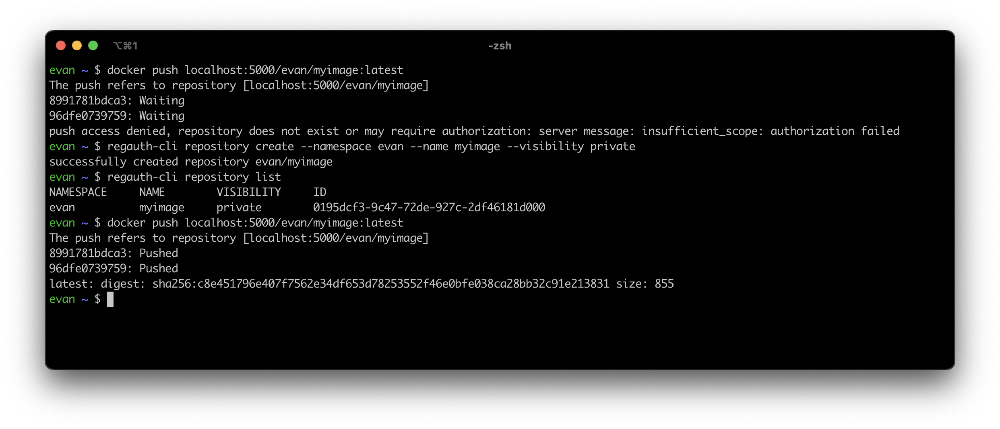

# regauth

An API-driven container registry authorization server and command-line client, based on
the [Distribution Token Authentication Specification](https://distribution.github.io/distribution/spec/auth/).



## Overview

- REST API with command-line client.
- Users get their own namespace, in which they can create container image repositories.
- Teams allow multiple users to collaborate on repositories in a shared namespace.
- Personal access tokens are used to authenticate to the container registry and the API.
- Pull/push/delete access to repositories is restricted based on the namespace, visibility of the repository and
  permissions assigned to the personal access token.

# Installation

## Server

### Kubernetes

A Helm chart is available in the [charts/regauth](charts/regauth) directory.

### Docker

A container image is available from the GitHub Container
Registry: [evanebb/regauth](https://github.com/evanebb/regauth/pkgs/container/regauth).

Example run command:

```shell
docker run \
  --name regauth -p 8000:8000 \
  -v ./path/to/config.yml:/etc/regauth/config.yml \
  -v ./path/to/cert.pem:/etc/regauth/cert.pem \
  -v ./path/to/key.pem:/etc/regauth/key.pem \
  ghcr.io/evanebb/regauth:latest
```

Note that the above command assumes that you have:

- A registry and database instance already running.
- A configuration file (see [Configuration](#configuration)).
- An existing signing key and corresponding certificate for signing/verifying tokens.

A more complete example is available at [examples/docker-compose.yml](examples/docker-compose.yml), which also includes
the registry and database.
See [examples/README.md](examples/README.md) for instructions.

## Client

Grab the `regauth-cli` binary for your OS/architecture from
the [latest GitHub release](https://github.com/evanebb/regauth/releases).

Alternatively, you can install it using `go install`:

```shell
go install github.com/evanebb/regauth/cmd/regauth-cli@latest
```

Afterward, log into your regauth instance using your username and password:

```shell
regauth-cli login https://<regauth-host> --username <username> --password <password>
```

Generate a new personal access token, and use it to log in (change the description, expiration date and permission if
desired):

```shell
regauth-cli token create --description cli-token --expirationDate 2030-01-01T00:00:00Z --permission readWriteDelete --login
```

Copy the newly generated token, and log into your registry with the Docker CLI:

```shell
docker login <registry-host> --username <username> --password <token>
```

You can now start creating repositories and pushing to/pulling from them!
Use the following command to get more information about what you can do with the CLI:

```shell
regauth-cli --help
```

# Configuration

The server can be configured through a YAML file, or through environment variables.
A reference configuration file containing all possible options can be found
at [configuration/config-reference.yml](configuration/config-reference.yml).

All options in the configuration file can also be overridden using similarly named environment variables.
All environment variables are prefixed with `REGAUTH_` to avoid possible conflicts.
For example, to override the `database.password` option, specify the `REGAUTH_DATABASE_PASSWORD` environment variable.

# Development

For local development instructions, see [CONTRIBUTING.md](CONTRIBUTING.md).
